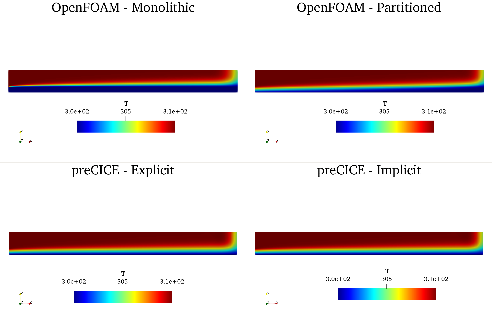
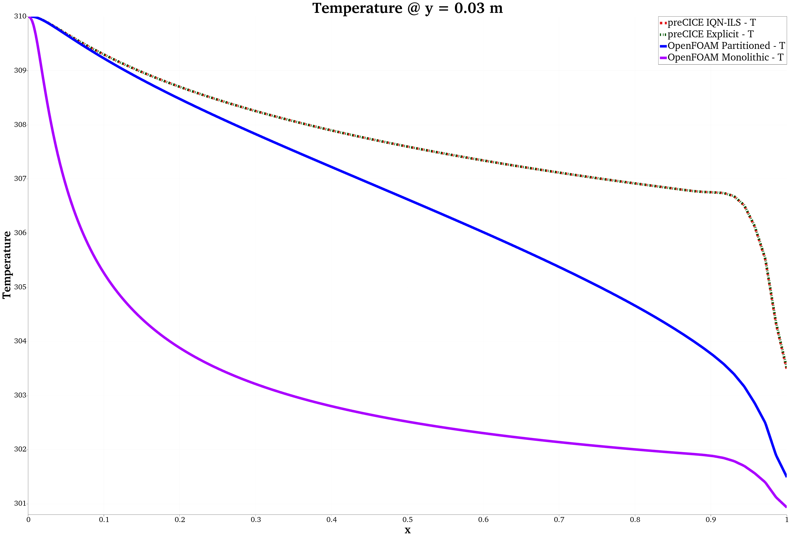
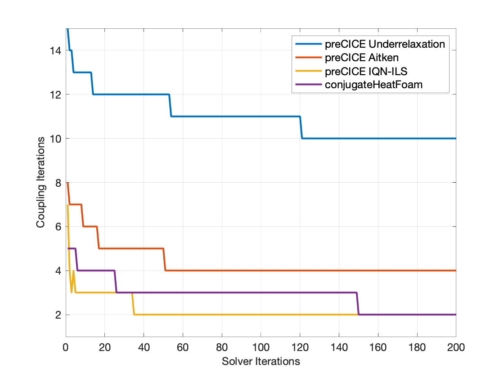

This repository contains preCICE test cases for conjugate heat transfer of channel flow, which are extension to the work of Holger Marschall [conjugateHeatFoam](https://bitbucket.org/hmarschall/conjugateheatfoam/src/master/)

# Directory Structure
**conjugateHeatFoam** Copy of the repository: [conjugateHeatFoam](https://bitbucket.org/hmarschall/conjugateheatfoam/src/master/)

conjugateHeatFoam cases:
- **OpenFoam_Monolithic** Monolithic coupling using conjugateHeatFoam
- **OpenFoam_Partitioned** Partitioned coupling using conjugateHeatFoam

preCICE cases:
- **preCICE_Case** Contains the fluid and solid side setups as well as the preCICE configuration. Configuration files for different coupling schemes are in `preCICE_Configs` directory. To use different acceleration scheme, copy the respective configuration file into the case directory with name `precice-config.xml`. For example, to test Aitken acceleration:
  
```bash
cp preCICE_Case/precice-config-Aitken.xml preCICE_Case/precice-config.xml
```

All the cases can be directly run by moving in respective directory and executing `./Allrun`.

# preCICE Coupling

## Software Versions
- OpenFOAM: 19.20
- preCICE: 2.1.0
- preCICE OpenFOAM Adapter: 

## Participant Setup
- Fluid Solver: `scalarTransportFoam`
- Solid Solver: `laplacianFoam`

All the boundary conditions, physical properties, solver and discretization settings are the same as the main OpenFOAM cases.

Coupling parameters are:
- **Time window size:** 0.01
- **Convergence measure:** Temperature (In OpenFOAM cases heat flux is also used, however the residuals of heat flux in OpenFOAM cases are always zero. Therefore heat flux is not included in the convergence measure.)
- **Relative convergence tolerance:** 1e-5 (Same as OpenFOAM cases)

### Underrelaxation
- **Underrelaxation factor:** 0.5 (Same as OpenFOAM cases)

### Aitken
- **Initial relaxation factor:** 0.5

### Quasi-Newton
- **Quasi-Newton Scheme:** IQN-ILS
- **Initial relaxation factor:** 0.5
- **Maximum used iterations:** 80
- **Reused time windows:** 10
- **Filter:** QR1 with 1e-8

# Results
## Physics
As for quick qualitative check, temperature contours are compared for implicit and explicit coupling. Acceleration method for the implicit coupling is quasi-Newton for preCICE case.



in general, physics of the flow seems quite similar in both variants, OpenFOAM and preCICE. For more quantitative comparison, values at **y=0.03** along the x-direction.



As it can be seen, we see large difference between the monolithic and partitioned approach for conjugateHeatFoam, while explicit and implicit coupling shows no difference for the preCICE cases. If we compare the implicit results of preCICE and conjugateHeatFoam, we see variation in the quantitive results. We suspect that it is related to one of the physical quantities, one possibility is the contact resistance between solid and fluid, which we could not figure out whether it is used in conjugateHeatFoam or not.

## Coupling
In order to compare the performance of difference acceleration techniques, number of coupling iterations at each time step are plotted.



For first 200 iterations, average iteration numbers per timestep are

- **Underrelaxation** : 2.21
- **Aitken**: 2.02
- **IQN-ILS**: 2.36
- **conjugateHeatFoam**: 2.90

Number of coupling iterations are the same after time step of ~200. All the preCICE relaxation schemes showed similar performance and resulted in fewer inner iterations than the underrelaxation method of conjugateHeatFoam. In particular, the quasi-Newton acceleration shows no superior performance as the case is not strongly coupled, meaning if underrelaxation already only requires a few iterations, quasi-Newton can't shine.