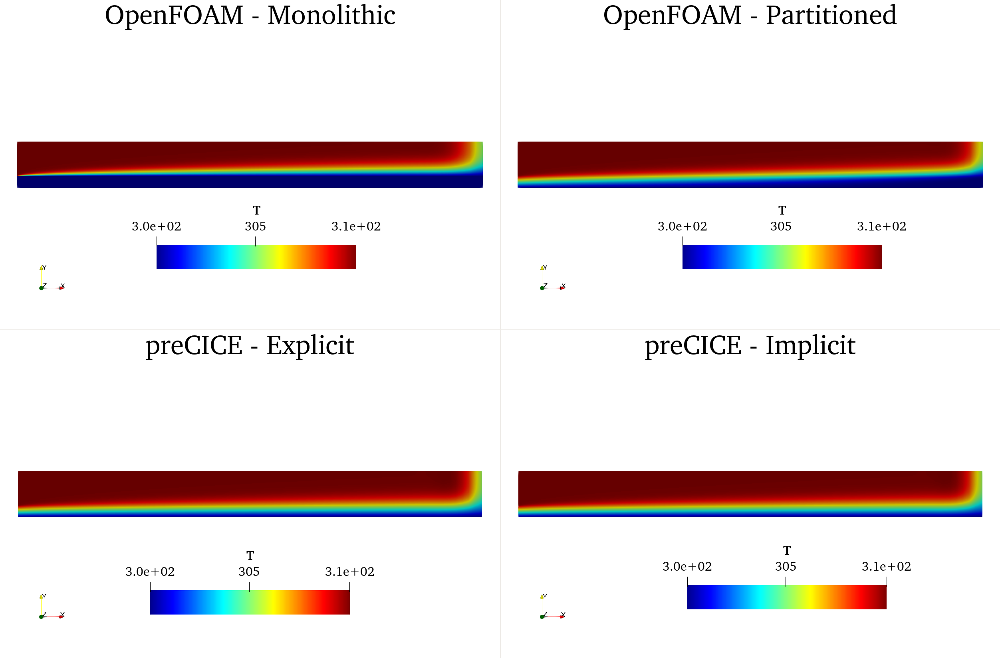
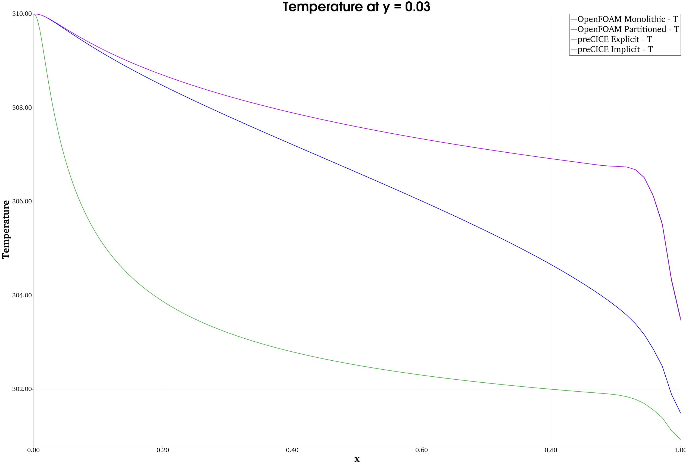
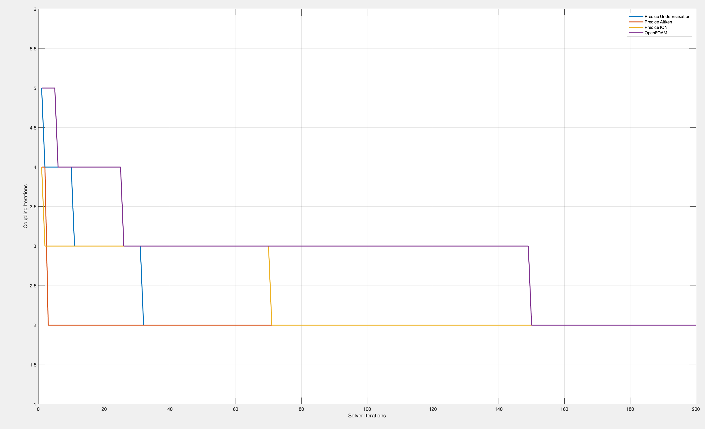

This is a fork repository from work of  Dr.-Ing. Holger Marschall: [conjugateHeatFoam](https://bitbucket.org/hmarschall/conjugateheatfoam/src/master/)

# Directory Structure
**conjugateHeatFoam** Copy of the for fork repository. [conjugateHeatFoam](https://bitbucket.org/hmarschall/conjugateheatfoam/src/master/)

conjugateHeatFoam cases:
- **OpenFoam_Monolithic** Monolithic coupling using conjugateHeatFoam
- **OpenFoam_Partitioned** Partitioned coupling using conjugateHeatFoam

preCICE cases:
- **preCICE_Explicit** Explicit coupling using preCICE
- **preCICE_Implicit_Underrelaxation** Implicit coupling with underrelaxation using preCICE
- **preCICE_Implicit_Aitken** Implicit coupling with Aitken acceleration using preCICE
- **preCICE_Implicit_IQN** Implicit coupling with Quasi-Newton acceleration coupling using preCICE

All the cases can be directly run by moving in respective directory and executing `./Allrun`.

# preCICE Coupling
- Fluid Solver: `scalarTransportFoam`
- Solid Solver: `laplacianFoam`

All the boundary conditions, physical properties, solver and discretization settings are the same as the main OpenFOAM cases.

Coupling parameters are:
- **Time window size:** 0.01
- **Convergence measure:** Temperature (In OpenFOAM cases heat flux is also used, however the residuals of heat flux in OpenFOAM cases are always zero. Therefore heat flux is not included in the convergence measure.)
- **Relative convergence tolerance:** 1e-5 (Same as OpenFOAM cases)
- **Maximum iterations:** 100 (Same as OpenFOAM cases)

## Underrelaxation
- **Underrelaxation factor:** 0.5 (Same as OpenFOAM cases)

## Aitken
- **Initial relaxation factor:** 0.5

## Quasi-Newton
- **Quasi-Newton Scheme:** ILS
- **Initial relaxation factor:** 0.5
- **Maximum used iterations:** 80
- **Reused time windows:** 10
- **Filter:** QR1 with 1e-8

# Results
## Physics
As for quick qualitative check, temperature contours are compared for implicit and explicit coupling. Acceleration method for the implicit coupling is Quasi-Newton for preCICE case.

in general, physics of the flow seems quite similar in both variants, OpenFOAM and preCICE. For more quantitative comparison, values at **y=0.03** along the x-direction.

As it can be seen, we see large difference between the monolithic and partitioned approach for conjugateHeatFoam, while explicit and implicit coupling shows no difference for the preCICE cases. If we compare the implicit results of preCICE and conjugateHeatFoam, we see variation in the quantitive results. We suspect that it is related to one of the physical quantities, one possibility is the contact resistance between solid and fluid, which we could not figure out whether it is used in conjugateHeatFoam or not.

## Coupling
In order to compare the performance of difference acceleration techniques, number of coupling iterations at each time step are plotted.

Number of coupling iterations are the same after time step of ~200. First of all, all the preCICE relaxation schemes resulted in fewer inner iterations than the underrelaxation method of conjugateHeatFoam. Especially the dynamic Aitken underrelaxation showed the best performance. Since the case is not strongly coupled, the performance of Quasi-Newton acceleration is not significant.